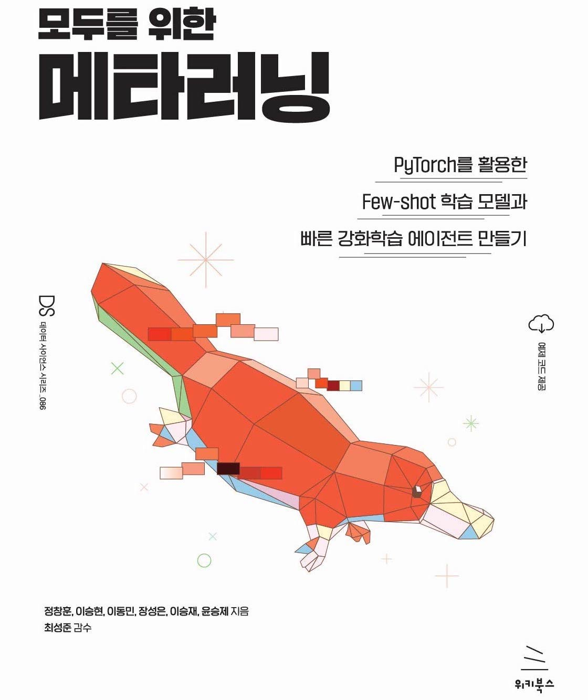

<!-- ALL-CONTRIBUTORS-BADGE:START - Do not remove or modify this section -->

<!-- ALL-CONTRIBUTORS-BADGE:END -->

  

# 모두를 위한 메타러닝: PyTorch를 활용한 Few-shot 학습 모델과 빠른 강화학습 에이전트 만들기

"모두를 위한 메타러닝" 책을 읽으면서 실습을 진행한 코드 레포지토리입니다.
[원본 저장소](https://github.com/dongminlee94/meta-learning-for-everyone)

<h2>0. Load-dataset code</h2>

- [Omniglot](https://github.com/ChoiDae1/Meta-learning-Study/blob/main/src/meta_sl/load_dataset/load_omniglot_my.ipynb) 
- [Sinusoid](https://github.com/ChoiDae1/Meta-learning-Study/blob/main/src/meta_sl/load_dataset/load_sinusoid_my.ipynb) 
- [Half-Cheetah](https://github.com/ChoiDae1/Meta-learning-Study/tree/main/src/meta_rl/envs)

<h2>1. Meta-Supervised-learning code</h2>

- model-based  
(1) [MANN](https://github.com/ChoiDae1/Meta-learning-Study/blob/main/src/meta_sl/model-based/mann_my.ipynb) &nbsp;&nbsp;(2) [SNAIL](https://github.com/ChoiDae1/Meta-learning-Study/blob/main/src/meta_sl/model-based/snail_my.ipynb)

- optimization-based 
(1) [MAML-Regression](https://github.com/ChoiDae1/Meta-learning-Study/blob/main/src/meta_sl/opt-based/maml_regression_my.ipynb)&nbsp;&nbsp;(2) [MAML-Classification](
https://github.com/ChoiDae1/Meta-learning-Study/blob/main/src/meta_sl/opt-based/maml_classification_my.ipynb)

- metric-based 
(1) [MachingNet](https://github.com/ChoiDae1/Meta-learning-Study/blob/main/src/meta_sl/metric-based/matching_network_my.ipynb)&nbsp;&nbsp;(2) [PrototypicalNet](
https://github.com/ChoiDae1/Meta-learning-Study/blob/main/src/meta_sl/metric-based/prototypical_network_my.ipynb)

<h2>2. Meta-Reinforce-learning code</h2>

- recurrent-policies-based  
(1) [RL^2](https://github.com/ChoiDae1/Meta-learning-Study/tree/main/src/meta_rl/rl2) &nbsp;&nbsp;

- optimization-based 
(1) [MAML-RL](https://github.com/ChoiDae1/Meta-learning-Study/tree/main/src/meta_rl/maml)&nbsp;&nbsp;

- context-based 
(1) [PEARL](https://github.com/ChoiDae1/Meta-learning-Study/tree/main/src/meta_rl/pearl)

